# T-Shirt Sizing Guide for Azure Deployment

Complete guide for deploying EVA Domain Assistant 2.0 to Azure using standardized t-shirt sizes. Each size is optimized for specific use cases with pre-configured resource allocations, cost estimates, and performance characteristics.

## 📊 Quick Comparison

| Size | Use Case | Users | Monthly Cost | Setup Time | Uptime SLA |
|------|----------|-------|--------------|------------|------------|
| **XS** | Demo/POC | 1-10 | $150-300 | 20 min | 99.5% |
| **S** | Development | 10-50 | $400-600 | 30 min | 99.9% |
| **M** | Production | 50-500 | $1,500-2,500 | 45 min | 99.95% |
| **L** | Multi-tenant Enterprise | 500-5000+ | $5,000-10,000+ | 60 min | 99.99% |

---

## 📐 Size XS - Demo/POC

**Purpose**: Proof of concept, demos, testing, small pilots  
**Ideal For**: Decision makers evaluating the platform, single-user testing, conference demos

### Resource Configuration

#### AKS Cluster
- **SKU Tier**: Free (for non-production)
- **Kubernetes Version**: 1.28+ (latest stable)
- **System Node Pool**:
  - VM Size: `Standard_B4ms` (4 vCPU, 16GB RAM)
  - Node Count: 1 (no auto-scaling)
  - OS Disk: 128GB Standard SSD
- **User Node Pool**: Disabled (workloads run on system pool)
- **Private Cluster**: Disabled
- **Network Plugin**: Azure CNI Basic

#### Azure Container Registry (ACR)
- **SKU**: Basic
- **Geo-replication**: Disabled
- **Public Network Access**: Enabled
- **Retention Policy**: 7 days

#### Key Vault
- **SKU**: Standard
- **Soft Delete Retention**: 7 days
- **Purge Protection**: Disabled
- **Public Network Access**: Enabled

#### Networking
- **Virtual Network**: 10.0.0.0/16
- **AKS Subnet**: 10.0.0.0/20 (4096 IPs)
- **DDoS Protection**: Disabled
- **Private Endpoints**: Disabled
- **Application Gateway**: Disabled (use LoadBalancer service)

#### Monitoring
- **Log Analytics Retention**: 30 days
- **Application Insights Sampling**: 50%
- **Metric Alerts**: Disabled

### Performance Characteristics

- **Concurrent Users**: 1-10
- **Documents**: Up to 1,000
- **Embedding Vectors**: Up to 500K
- **Query Response Time**: 2-5 seconds
- **Ingestion Rate**: 10 docs/min

### Cost Breakdown

| Resource | Configuration | Monthly Cost (USD) |
|----------|--------------|-------------------|
| AKS (1 B4ms) | 4 vCPU, 16GB RAM | $120 |
| ACR Basic | 10GB storage | $5 |
| Key Vault Standard | 10K operations | $5 |
| Virtual Network | Standard | $10 |
| Log Analytics | 5GB/month | $10 |
| Public IP | Static | $5 |
| **Total** | | **$155/month** |

> **Cost Optimization**: Stop AKS cluster outside demo hours to reduce costs to ~$50/month

### Deployment Command

```bash
./scripts/deploy-tshirt.ps1 -Size XS -Environment demo -Location eastus
```

---

## 📐 Size S - Development

**Purpose**: Development, staging, QA testing, small production workloads  
**Ideal For**: Dev teams, integration testing, small internal deployments

### Resource Configuration

#### AKS Cluster
- **SKU Tier**: Standard (99.9% SLA)
- **Kubernetes Version**: 1.28+ (latest stable)
- **System Node Pool**:
  - VM Size: `Standard_D2s_v5` (2 vCPU, 8GB RAM)
  - Node Count: 2 (fixed, no auto-scaling)
  - OS Disk: 128GB Premium SSD
- **User Node Pool**:
  - VM Size: `Standard_D4s_v5` (4 vCPU, 16GB RAM)
  - Initial: 2 nodes
  - Auto-scaling: 2-5 nodes
  - OS Disk: 256GB Premium SSD
- **Private Cluster**: Optional (configurable)
- **Network Plugin**: Azure CNI

#### Azure Container Registry (ACR)
- **SKU**: Standard
- **Geo-replication**: Disabled
- **Public Network Access**: Enabled (or Private Endpoint optional)
- **Retention Policy**: 14 days
- **Content Trust**: Enabled

#### Key Vault
- **SKU**: Standard
- **Soft Delete Retention**: 30 days
- **Purge Protection**: Enabled
- **Public Network Access**: Enabled (or Private Endpoint optional)
- **RBAC**: Enabled

#### Networking
- **Virtual Network**: 10.0.0.0/16
- **AKS Subnet**: 10.0.0.0/19 (8192 IPs)
- **AppGW Subnet**: 10.0.32.0/24 (256 IPs)
- **Private Endpoint Subnet**: 10.0.33.0/24
- **DDoS Protection**: Disabled
- **Application Gateway**: Disabled (use LoadBalancer)

#### Monitoring
- **Log Analytics Retention**: 30 days
- **Application Insights Sampling**: 25%
- **Metric Alerts**: Basic (CPU, memory thresholds)
- **Action Groups**: Email notifications

### Performance Characteristics

- **Concurrent Users**: 10-50
- **Documents**: Up to 10,000
- **Embedding Vectors**: Up to 5 million
- **Query Response Time**: 1-3 seconds
- **Ingestion Rate**: 50 docs/min
- **Availability**: 99.9% SLA

### Cost Breakdown

| Resource | Configuration | Monthly Cost (USD) |
|----------|--------------|-------------------|
| AKS System (2 D2s_v5) | 4 vCPU, 16GB RAM | $140 |
| AKS User (2-5 D4s_v5) | 8-20 vCPU, 32-80GB RAM | $280-700 |
| ACR Standard | 100GB storage | $20 |
| Key Vault Standard | 50K operations | $10 |
| Virtual Network | Standard | $15 |
| Log Analytics | 20GB/month | $50 |
| Public IP | Static | $5 |
| **Total** | | **$520-940/month** |

**Average**: ~$600/month

### Deployment Command

```bash
./scripts/deploy-tshirt.ps1 -Size S -Environment dev -Location eastus
```

---

## 📐 Size M - Production

**Purpose**: Production workloads, business-critical applications  
**Ideal For**: Single-tenant production, medium enterprises, government departments

### Resource Configuration

#### AKS Cluster
- **SKU Tier**: Standard (99.95% SLA with Availability Zones)
- **Kubernetes Version**: 1.28+ (latest stable)
- **Availability Zones**: 3 zones (1, 2, 3)
- **System Node Pool**:
  - VM Size: `Standard_D4s_v5` (4 vCPU, 16GB RAM)
  - Node Count: 3 (1 per zone, no auto-scaling)
  - OS Disk: 256GB Premium SSD
- **User Node Pool**:
  - VM Size: `Standard_D8s_v5` (8 vCPU, 32GB RAM)
  - Initial: 5 nodes
  - Auto-scaling: 5-15 nodes
  - OS Disk: 512GB Premium SSD
- **Private Cluster**: Enabled
- **Network Plugin**: Azure CNI
- **Network Policy**: Azure (Network Security Groups)
- **Azure Defender**: Enabled

#### Azure Container Registry (ACR)
- **SKU**: Premium
- **Geo-replication**: 1 additional region (DR)
- **Public Network Access**: Disabled
- **Private Endpoint**: Enabled
- **Retention Policy**: 30 days
- **Content Trust**: Enabled
- **Quarantine Policy**: Enabled

#### Key Vault
- **SKU**: Premium (HSM-backed)
- **Soft Delete Retention**: 90 days
- **Purge Protection**: Enabled
- **Public Network Access**: Disabled
- **Private Endpoint**: Enabled
- **RBAC**: Enabled
- **Diagnostic Logs**: Enabled

#### Networking
- **Virtual Network**: 10.0.0.0/16
- **AKS Subnet**: 10.0.0.0/18 (16384 IPs)
- **AppGW Subnet**: 10.0.64.0/24 (256 IPs)
- **Private Endpoint Subnet**: 10.0.65.0/24
- **Database Subnet**: 10.0.66.0/24
- **DDoS Protection**: Standard
- **Application Gateway**:
  - SKU: WAF_v2
  - Auto-scaling: 2-10 instances
  - WAF Mode: Prevention
  - OWASP Rule Set: 3.2

#### Monitoring
- **Log Analytics Retention**: 90 days
- **Application Insights Sampling**: 10%
- **Metric Alerts**: Comprehensive (CPU, memory, disk, network, pod status)
- **Action Groups**: Email + PagerDuty/Teams webhook
- **Azure Defender**: Enabled for containers
- **Diagnostic Settings**: All resources

### Performance Characteristics

- **Concurrent Users**: 50-500
- **Documents**: Up to 100,000
- **Embedding Vectors**: Up to 50 million
- **Query Response Time**: 0.5-2 seconds
- **Ingestion Rate**: 200 docs/min
- **Availability**: 99.95% SLA
- **RPO/RTO**: 1 hour / 2 hours

### Cost Breakdown

| Resource | Configuration | Monthly Cost (USD) |
|----------|--------------|-------------------|
| AKS System (3 D4s_v5) | 12 vCPU, 48GB RAM | $630 |
| AKS User (5-15 D8s_v5) | 40-120 vCPU, 160-480GB | $1,400-4,200 |
| ACR Premium (2 regions) | 500GB storage, geo-rep | $100 |
| Application Gateway WAF_v2 | Auto-scaling 2-10 | $400-800 |
| Key Vault Premium | 100K operations | $15 |
| Virtual Network | Standard | $20 |
| DDoS Protection | Standard | $3,000 |
| Log Analytics | 100GB/month | $250 |
| Azure Defender | Container monitoring | $15 |
| Public IP (2) | Static | $10 |
| **Total** | | **$5,840-9,040/month** |

**Average**: ~$2,000/month (without DDoS Protection), ~$5,000/month (with DDoS)

> **Note**: DDoS Protection is optional but recommended for internet-facing production workloads. It protects the entire VNet.

### Deployment Command

```bash
./scripts/deploy-tshirt.ps1 -Size M -Environment production -Location eastus
```

---

## 📐 Size L - Multi-Tenant Enterprise

**Purpose**: Multi-tenant SaaS, enterprise-scale, government-wide deployments  
**Ideal For**: Serving multiple departments/clients, high-scale production, 24/7 mission-critical

### Resource Configuration

#### AKS Cluster
- **SKU Tier**: Premium (99.99% SLA with Uptime SLA)
- **Kubernetes Version**: 1.28+ (latest stable)
- **Availability Zones**: 3 zones (1, 2, 3)
- **System Node Pool**:
  - VM Size: `Standard_D8s_v5` (8 vCPU, 32GB RAM)
  - Node Count: 5 (distributed across zones)
  - OS Disk: 512GB Premium SSD
- **User Node Pool** (Application):
  - VM Size: `Standard_D16s_v5` (16 vCPU, 64GB RAM)
  - Initial: 10 nodes
  - Auto-scaling: 10-50 nodes
  - OS Disk: 1TB Premium SSD
- **GPU Node Pool** (Optional, for ML inference):
  - VM Size: `Standard_NC6s_v3` (6 vCPU, 112GB RAM, Tesla V100)
  - Initial: 0 nodes
  - Auto-scaling: 0-5 nodes
- **Private Cluster**: Enabled
- **Network Plugin**: Azure CNI
- **Network Policy**: Calico (advanced policies)
- **Azure Defender**: Enabled
- **Workload Identity**: Enabled
- **Azure Policy**: Enabled (Kubernetes policies)

#### Azure Container Registry (ACR)
- **SKU**: Premium
- **Geo-replication**: 3+ regions (multi-region DR)
- **Public Network Access**: Disabled
- **Private Endpoint**: Enabled (per region)
- **Retention Policy**: 90 days
- **Content Trust**: Enabled
- **Quarantine Policy**: Enabled
- **Vulnerability Scanning**: Enabled (Defender for Containers)
- **Anonymous Pull**: Disabled

#### Key Vault
- **SKU**: Premium (HSM-backed)
- **Soft Delete Retention**: 90 days
- **Purge Protection**: Enabled
- **Public Network Access**: Disabled
- **Private Endpoint**: Enabled (per region)
- **RBAC**: Enabled
- **Diagnostic Logs**: Enabled
- **Automated Secret Rotation**: Enabled
- **Network ACLs**: Restricted to AKS subnets

#### Networking
- **Virtual Network**: 10.0.0.0/12 (1 million IPs, multi-tenant isolation)
- **AKS Subnet**: 10.0.0.0/16 (65536 IPs)
- **AppGW Subnet**: 10.1.0.0/24 (256 IPs)
- **Private Endpoint Subnet**: 10.1.1.0/24
- **Database Subnet**: 10.1.2.0/24
- **Management Subnet**: 10.1.3.0/24
- **DDoS Protection**: Standard (VNet-wide)
- **Azure Firewall**: Premium (intrusion detection, TLS inspection)
- **Application Gateway**:
  - SKU: WAF_v2
  - Auto-scaling: 5-50 instances
  - WAF Mode: Prevention
  - OWASP Rule Set: 3.2
  - Custom Rules: Rate limiting, geo-filtering

#### Data Storage
- **Azure PostgreSQL Flexible Server**: 
  - SKU: General Purpose (D8s_v3)
  - High Availability: Zone-redundant
  - Backup Retention: 35 days
  - Geo-redundant Backup: Enabled
- **Azure Redis Cache**:
  - SKU: Premium P3 (26GB)
  - Clustering: 3 shards
  - Persistence: RDB + AOF

#### Monitoring & Security
- **Log Analytics Retention**: 180 days (6 months)
- **Application Insights Sampling**: 5% (high volume)
- **Metric Alerts**: Advanced (custom metrics, anomaly detection)
- **Action Groups**: Email + PagerDuty + Teams/Slack webhooks
- **Azure Defender**: Enabled (containers, Key Vault, storage)
- **Diagnostic Settings**: All resources with archival to storage
- **Azure Sentinel**: SIEM integration (optional)
- **Azure Monitor Workbooks**: Custom dashboards per tenant

### Performance Characteristics

- **Concurrent Users**: 500-5000+
- **Tenants**: 10-100+ isolated tenants
- **Documents**: Up to 10 million
- **Embedding Vectors**: Up to 500 million
- **Query Response Time**: 0.3-1 second (p95)
- **Ingestion Rate**: 1000+ docs/min
- **Availability**: 99.99% SLA (52 minutes downtime/year)
- **RPO/RTO**: 15 minutes / 30 minutes
- **Disaster Recovery**: Multi-region active-passive

### Advanced Features

- **Multi-tenancy Isolation**: Kubernetes namespaces + network policies per tenant
- **Horizontal Pod Autoscaling (HPA)**: CPU/memory/custom metrics
- **Cluster Autoscaling**: Dynamic node provisioning
- **Pod Disruption Budgets (PDB)**: Ensure minimum availability during updates
- **GitOps**: Flux/ArgoCD for declarative deployments
- **Service Mesh**: Optional Istio/Linkerd for advanced traffic management
- **Chaos Engineering**: Azure Chaos Studio integration
- **Blue-Green Deployments**: Zero-downtime updates

### Cost Breakdown

| Resource | Configuration | Monthly Cost (USD) |
|----------|--------------|-------------------|
| AKS System (5 D8s_v5) | 40 vCPU, 160GB RAM | $2,100 |
| AKS User (10-50 D16s_v5) | 160-800 vCPU, 640-3200GB | $8,400-42,000 |
| AKS GPU (0-5 NC6s_v3) | Optional ML inference | $0-10,800 |
| ACR Premium (4 regions) | 2TB storage, geo-rep | $300 |
| Application Gateway WAF_v2 | Auto-scaling 5-50 | $1,000-5,000 |
| Azure Firewall Premium | TLS inspection | $1,250 |
| Key Vault Premium | 500K operations | $50 |
| PostgreSQL Flexible Server | D8s_v3, HA, geo-backup | $800 |
| Redis Cache Premium P3 | 26GB, 3 shards | $1,200 |
| Virtual Network | Advanced | $50 |
| DDoS Protection | Standard | $3,000 |
| Log Analytics | 500GB/month | $1,250 |
| Azure Defender | Multi-resource | $100 |
| Public IPs (5) | Static | $25 |
| Bandwidth | 10TB/month egress | $870 |
| **Total (Baseline)** | | **$19,395/month** |
| **Total (High Scale)** | | **$68,795/month** |

**Average**: ~$10,000-15,000/month for most enterprise deployments

> **Cost Optimization Strategies**:
> - Use Reserved Instances (RI) for baseline capacity: Save 20-40%
> - Enable Azure Hybrid Benefit if you have Windows licenses
> - Use Spot Instances for non-critical workloads: Save up to 90%
> - Right-size VMs based on actual usage metrics

### Deployment Command

```bash
./scripts/deploy-tshirt.ps1 -Size L -Environment production -Location eastus -EnableMultiRegion -SecondaryRegion westus2
```

---

## 🎯 Decision Matrix

### Choose Your Size

```mermaid
graph TD
    A[Start] --> B{What's your primary use case?}
    B -->|Demo/POC| C[Size XS]
    B -->|Development| D[Size S]
    B -->|Production Single-Tenant| E{Expected Users?}
    B -->|Production Multi-Tenant| F[Size L]
    
    E -->|< 100 users| G[Size S]
    E -->|100-500 users| H[Size M]
    E -->|> 500 users| F
    
    C --> I{Budget < $300/month?}
    I -->|Yes| J[✅ Size XS]
    I -->|No| G
    
    D --> K{Need High Availability?}
    K -->|No| L[✅ Size S]
    K -->|Yes| H
    
    H --> M{Need 99.95%+ SLA?}
    M -->|No| N[✅ Size M without DDoS]
    M -->|Yes| O[✅ Size M with DDoS]
    
    F --> P{Multi-region DR needed?}
    P -->|No| Q[✅ Size L Single Region]
    P -->|Yes| R[✅ Size L Multi-Region]
```



### Detailed Selection Criteria

| Criteria | XS | S | M | L |
|----------|----|----|----|----|
| **Use Case** | Demo, POC | Dev/Staging | Production | Enterprise/Multi-tenant |
| **Concurrent Users** | 1-10 | 10-50 | 50-500 | 500-5000+ |
| **Documents** | < 1K | < 10K | < 100K | < 10M |
| **SLA Required** | Best effort | 99.9% | 99.95% | 99.99% |
| **Budget** | $150-300 | $400-600 | $1,500-2,500 | $5,000+ |
| **Compliance** | Basic | Standard | Advanced | Full (FedRAMP, HIPAA) |
| **Support Level** | Community | Business hours | 24/7 | Premium 24/7 |
| **Disaster Recovery** | None | Manual backup | Automated DR | Multi-region DR |
| **Setup Time** | 20 min | 30 min | 45 min | 60 min |
| **Team Size** | 1-2 | 2-5 | 5-20 | 20-100+ |
| **Maintenance Window** | Anytime | Nights/weekends | Scheduled | Zero-downtime |

---

## 🚀 Getting Started

### 1. Prerequisites

Ensure you have the following installed:

```powershell
# Check Azure CLI
az --version  # Required: 2.50+

# Check Terraform
terraform version  # Required: 1.5+

# Check kubectl
kubectl version --client  # Required: 1.28+

# Check PowerShell
$PSVersionTable.PSVersion  # Required: 7.0+
```

### 2. Azure Setup

```bash
# Login to Azure
az login

# Set subscription
az account set --subscription "<YOUR_SUBSCRIPTION_ID>"

# Verify
az account show
```

### 3. Clone Repository

```bash
cd "c:\Users\marco\Documents\_AI Dev\EVA Suite\eva-da-2"
```

### 4. Deploy with Automation Script

```powershell
# Navigate to terraform directory
cd terraform

# Deploy Size XS (Demo)
.\scripts\deploy-tshirt.ps1 `
  -Size XS `
  -Environment demo `
  -Location eastus `
  -Owner "your.email@example.com" `
  -OpenAIKey "sk-your-key-here"

# Deploy Size M (Production)
.\scripts\deploy-tshirt.ps1 `
  -Size M `
  -Environment production `
  -Location eastus `
  -Owner "your.email@example.com" `
  -OpenAIKey "sk-your-key-here" `
  -EnableDDoS `
  -EnablePrivateCluster
```

### 5. Verify Deployment

```bash
# Get AKS credentials
az aks get-credentials \
  --resource-group pubsec-info-assistant-<ENV>-rg \
  --name pubsec-info-assistant-<ENV>-aks

# Check cluster
kubectl get nodes
kubectl get pods --all-namespaces
```

---

## 📝 Configuration Files

The automated deployment script generates the following files:

### Generated Files Structure

```
terraform/
├── environments/
│   ├── xs.tfvars           # Size XS configuration
│   ├── s.tfvars            # Size S configuration
│   ├── m.tfvars            # Size M configuration
│   ├── l.tfvars            # Size L configuration
│   └── custom.tfvars       # Your custom overrides
├── scripts/
│   ├── deploy-tshirt.ps1   # Automated deployment script
│   └── validate-size.ps1   # Pre-deployment validation
└── .terraform/
```

### Manual Configuration

If you prefer manual deployment:

```bash
# 1. Copy template
cp environments/xs.tfvars environments/custom.tfvars

# 2. Edit configuration
code environments/custom.tfvars

# 3. Initialize Terraform
terraform init

# 4. Plan deployment
terraform plan -var-file="environments/custom.tfvars"

# 5. Apply infrastructure
terraform apply -var-file="environments/custom.tfvars"
```

---

## 🔄 Scaling Between Sizes

### Upgrading from XS to S

```powershell
# Update deployment to Size S
.\scripts\deploy-tshirt.ps1 -Size S -Environment production -Upgrade

# Terraform will show the changes (nodes, SKUs)
# Review and confirm the plan
```

### Downgrading (Cost Optimization)

```powershell
# Downgrade from M to S (e.g., after peak season)
.\scripts\deploy-tshirt.ps1 -Size S -Environment production -Downgrade

# WARNING: Review capacity implications before downgrading
```

### Manual Scaling (In-Place)

```bash
# Scale AKS user node pool
az aks nodepool update \
  --resource-group <RG> \
  --cluster-name <AKS> \
  --name userpool \
  --min-count 5 \
  --max-count 20

# Scale backend pods
kubectl scale deployment pubsec-backend --replicas=10
```

---

## 🔒 Security Considerations by Size

### Size XS (Demo)
- ✅ Basic authentication
- ✅ HTTPS enabled
- ⚠️ Public endpoints (demo convenience)
- ⚠️ Minimal logging

### Size S (Development)
- ✅ RBAC enabled
- ✅ Network Security Groups
- ✅ Key Vault for secrets
- ✅ 30-day audit logs
- ⚠️ Optional private endpoints

### Size M (Production)
- ✅ Private cluster
- ✅ Private endpoints (ACR, Key Vault)
- ✅ DDoS Protection Standard
- ✅ WAF Prevention mode
- ✅ Azure Defender enabled
- ✅ 90-day audit logs
- ✅ Automated secret rotation

### Size L (Enterprise)
- ✅ All Size M features
- ✅ Azure Firewall Premium
- ✅ Multi-region encryption
- ✅ HSM-backed Key Vault
- ✅ Azure Sentinel integration
- ✅ Compliance certifications
- ✅ 180-day audit logs
- ✅ Advanced threat protection

---

## 📊 Monitoring & Alerting by Size

### Size XS (Demo)
- Basic Azure Monitor metrics
- No alerts configured
- Manual monitoring via portal

### Size S (Development)
- Log Analytics (30 days)
- Basic alerts: CPU > 80%, Memory > 80%
- Email notifications

### Size M (Production)
- Log Analytics (90 days)
- Comprehensive alerts:
  - CPU/Memory/Disk thresholds
  - Pod restart counts
  - API error rates
  - Application Insights anomalies
- Email + webhook notifications
- Application Insights with 10% sampling

### Size L (Enterprise)
- Log Analytics (180 days)
- Advanced monitoring:
  - Custom metrics per tenant
  - Anomaly detection (ML-based)
  - Security threat detection
  - Performance baselines
- Multi-channel alerts (Email, PagerDuty, Teams, Slack)
- Application Insights with 5% sampling (high volume)
- Custom dashboards per tenant

---

## 🆘 Support & Troubleshooting

### Deployment Issues

**Problem**: Terraform fails with quota exceeded
```bash
# Check current quotas
az vm list-usage --location eastus -o table

# Request increase
az support tickets create \
  --issue-type "quota" \
  --title "AKS Node Quota Increase"
```

**Problem**: AKS cluster creation fails
```bash
# Enable verbose logging
export TF_LOG=DEBUG
terraform apply -var-file="environments/m.tfvars"

# Check Azure activity log
az monitor activity-log list --resource-group <RG> --max-events 50
```

**Problem**: Private cluster cannot be accessed
```bash
# Use Azure Bastion or VPN
az network bastion create --resource-group <RG> --name bastion --vnet-name <VNET>

# Or enable temporary public access (dev only)
az aks update --resource-group <RG> --name <AKS> --api-server-authorized-ip-ranges "YOUR_IP/32"
```

### Performance Issues

**Problem**: Slow query responses
```bash
# Check pod resource usage
kubectl top pods -n default

# Check node resource usage
kubectl top nodes

# Scale up if needed
kubectl scale deployment pubsec-backend --replicas=5
```

**Problem**: High costs
```bash
# Review actual usage
az consumption usage list --start-date 2025-11-01 --end-date 2025-11-30

# Identify top resources
az cost-management query \
  --type ActualCost \
  --timeframe MonthToDate \
  --dataset-aggregation '{"totalCost":{"name":"Cost","function":"Sum"}}'
```

### Getting Help

1. **Documentation**: Check this guide and [DEPLOYMENT-OPTIONS.md](DEPLOYMENT-OPTIONS.md)
2. **Logs**: Review Terraform logs and Azure activity logs
3. **Community**: GitHub Issues or Stack Overflow
4. **Support**:
   - Size XS/S: Community support
   - Size M: Business hours support (SLA)
   - Size L: 24/7 premium support with dedicated SRE

---

## 📚 Additional Resources

- [Azure AKS Best Practices](https://docs.microsoft.com/azure/aks/best-practices)
- [Terraform Azure Provider Docs](https://registry.terraform.io/providers/hashicorp/azurerm/latest/docs)
- [Azure Pricing Calculator](https://azure.microsoft.com/pricing/calculator/)
- [Azure Well-Architected Framework](https://docs.microsoft.com/azure/architecture/framework/)
- [Kubernetes Production Best Practices](https://learnk8s.io/production-best-practices)

---

## 🔄 Version History

| Version | Date | Changes |
|---------|------|---------|
| 1.0.0 | 2025-11-30 | Initial t-shirt sizing guide with XS, S, M, L configurations |

---

**Maintained By**: DevOps/SRE Team  
**Last Updated**: 2025-11-30  
**Next Review**: 2026-02-28
